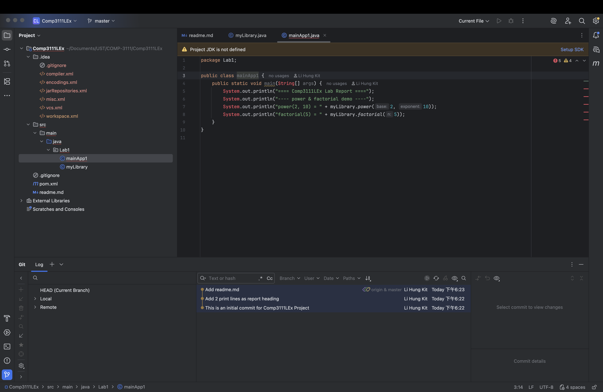

# Comp3111LEx

COMP 3111 Lab 1 - Introduction to Git & GitHub

## About

A simple Java project built with Maven. The `Lab1` package contains two classes:

- `myLibrary` - two utility functions: `power` and `factorial`
- `mainApp1` - the main application that calls the library functions

## Build & Run

- JDK 21
- Build: `mvn compile` or Build Project in IntelliJ IDEA
- Run: `mainApp1` in IntelliJ IDEA

## IntelliJ Screenshot

